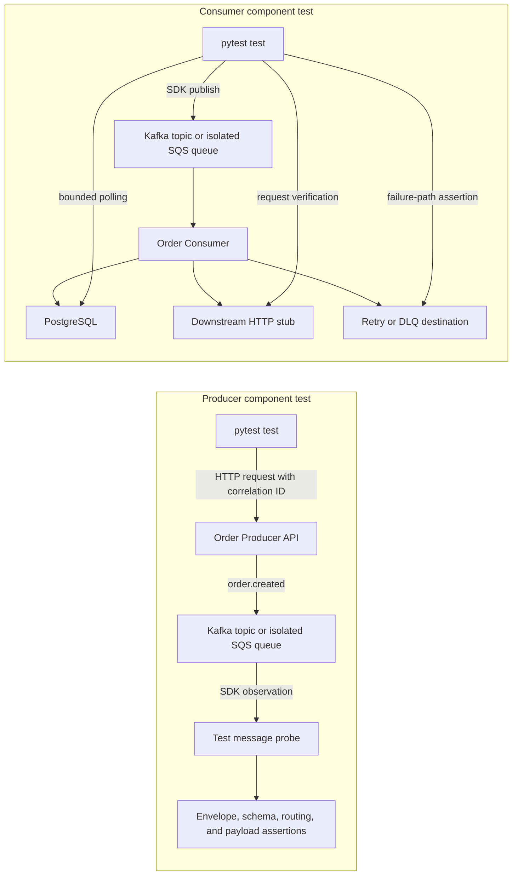
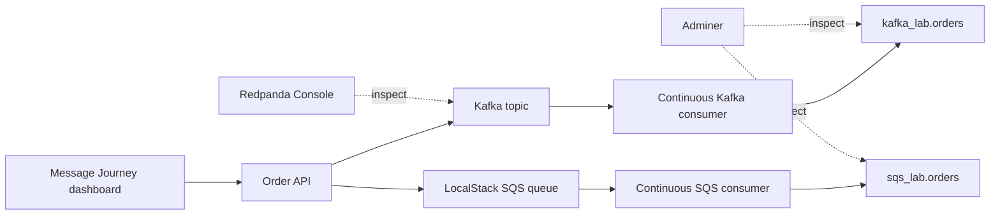

# Message Queue Test Automation Architecture

Status: Approved baseline for implementation  
Primary stack: Python 3.12, pytest, Confluent Kafka Python client, boto3, and Testcontainers  
Initial broker: Apache Kafka  
Second broker: Amazon SQS through LocalStack for local tests

## 1. Purpose

The framework demonstrates how to test asynchronous producers and consumers independently.

It answers two different questions:

1. Producer test: when an application action occurs, was the correct event published?
2. Consumer test: when a controlled event is delivered, did the consumer create the correct downstream result?

UI automation is not part of the core message test. Producer tests trigger an API directly unless a separate end-to-end scenario explicitly needs a UI.

## 2. Architectural principles

1. Decouple producer and consumer tests. A producer failure must not be confused with a consumer failure.
2. Use real broker APIs. Do not replace Kafka or SQS behavior with an in-memory queue mock in integration tests.
3. Isolate every test run. Topics, queues, consumer groups, event IDs, and correlation IDs must not collide across parallel runs.
4. Test observable behavior. Consumer tests assert database state, downstream requests, emitted events, offsets, acknowledgements, retries, and DLQ results.
5. Treat eventual consistency explicitly. Use bounded polling with useful timeout diagnostics; do not use fixed sleeps.
6. Expect duplicate delivery. Consumers must be idempotent when the delivery model is at least once.
7. Preserve broker differences. Common test interfaces must not conceal Kafka offsets or SQS visibility and receipt-handle behavior.
8. Make failures diagnosable. Failure output should identify the test run, event, broker destination, and the last observed state.

## 3. System context



## 4. Producer test design

The test framework acts as a consumer but tests only producer behavior.

```text
Provision isolated destination
    -> start test probe
    -> create correlation ID
    -> call producer API
    -> wait for matching event
    -> validate contract and routing
```

The test probe starts before the API call so its starting position is known. It scans only until a bounded deadline and matches the event using the test-created `correlation_id`.

Producer assertions include:

- Correct topic or queue.
- Correct event type and version.
- Correct Kafka key or SQS message-group and deduplication attributes.
- Correct headers/message attributes.
- Valid schema.
- Correct business payload.
- Non-empty event and correlation identifiers.
- Broker metadata useful for diagnosis.

## 5. Consumer test design

The test framework acts as a producer but tests only consumer behavior.

```text
Start consumer and dependencies
    -> publish controlled event through SDK
    -> wait for observable side effect
    -> verify acknowledgement behavior
    -> verify no unintended side effects
```

Consumer assertions include:

- Database record created or updated correctly.
- Expected downstream HTTP request made once with correct content.
- Expected follow-up event published.
- Kafka offset committed only after successful processing.
- SQS message deleted only after successful processing.
- Temporary failures retried according to policy.
- Permanent failures reach the DLQ.
- Duplicate delivery does not duplicate the business operation.

## 6. Kafka-specific semantics

Kafka is a retained, partitioned log. A record is located by:

```text
topic + partition + offset
```

Each consumer group has independent offsets. Therefore, a producer test can observe an event safely with a unique test group without stealing it from the application consumer.

Kafka probe defaults:

- Unique `group.id` per test or test run.
- `enable.auto.commit=false` so test behavior is explicit.
- Explicit starting position or offset-reset behavior.
- Bounded poll loop.
- `read_committed` for transactional-message scenarios.
- Capture topic, partition, offset, timestamp, key, and headers.

Consumer processing follows this at-least-once sequence:

```text
read event -> complete business effect -> commit next offset
```

If the database update succeeds but the offset is not committed before a crash, Kafka may deliver the event again. The consumer must therefore protect the business operation with the `event_id`.

## 7. SQS-specific semantics

SQS is a competing-consumer queue. Receiving a message temporarily hides it from other consumers. Deleting it acknowledges successful processing.

A test probe must never consume from a shared queue used by the real application consumer. Producer tests use one of these isolation patterns:

1. An ephemeral queue dedicated to the test.
2. An SNS subscription that fans out a copy to a dedicated test queue.
3. An isolated environment where the real consumer is disabled.

SQS probe defaults:

- Dedicated queue per test or test run.
- Long polling with a bounded overall deadline.
- Explicit message and system attributes.
- Visibility timeout aligned with the scenario.
- Delete the message only when the test owns the queue.
- Capture message ID, receipt metadata, receive count, group ID, and deduplication ID.

If processing fails and the message is not deleted, it becomes visible after the visibility timeout and may be delivered again. A redrive policy eventually moves repeatedly failing messages to a DLQ.

## 8. Event contract

The initial learning event is `order.created`.

```json
{
  "event_id": "1d253df2-a12f-4b55-b8db-3f421360df3a",
  "event_type": "order.created",
  "event_version": 1,
  "occurred_at": "2026-08-12T12:00:00Z",
  "correlation_id": "checkout-a43dd289",
  "causation_id": "request-9a2bcf19",
  "producer": "order-api",
  "data": {
    "order_id": "ORD-101",
    "customer_id": "CUS-22",
    "amount": 500.0,
    "currency": "INR"
  }
}
```

Identifier responsibilities:

| Field | Responsibility |
|---|---|
| `event_type` | Selects the event handler and describes what happened. |
| `event_id` | Uniquely identifies one event and supports idempotency. |
| `correlation_id` | Connects all events and logs in one business/test journey. |
| `causation_id` | Identifies the request or previous event that caused this event. |
| Kafka key | Controls partition routing and per-key order. |
| Kafka offset | Records a position within one topic partition for one consumer group. |

`correlation_id` is for tracing, not routing or deduplication. Multiple legitimate events may share the same correlation ID.

## 9. Framework components

```text
tests
  |
  +-- fixtures: lifecycle and isolated resources
  +-- event factory: valid and invalid controlled events
  +-- eventual assertion: bounded polling and diagnostics
  +-- contract validator: envelope and JSON Schema
  +-- kafka probe: Kafka-specific publishing and observation
  +-- sqs probe: SQS-specific publishing and observation
  +-- effect probes: database, HTTP stub, and emitted-event checks
  +-- evidence collector: IDs, offsets, messages, and final observed state
```

Only a small capability-oriented interface is shared:

```text
publish(event, destination)
wait_for(predicate, deadline)
collect_evidence()
```

Broker-specific configuration and acknowledgement operations remain explicit.

## 10. Test layers

| Layer | Purpose | Infrastructure |
|---|---|---|
| Unit | Event construction, schema helpers, routing functions, polling logic | None/mocks at code boundary |
| Contract | Envelope and payload compatibility | Schema files; Schema Registry later |
| Component producer | API to broker publication | Real producer app plus Kafka/SQS |
| Component consumer | Broker event to observable side effect | Real consumer plus DB/HTTP stub |
| Reliability | Retry, duplicate, ordering, crash, DLQ, recovery | Disposable real dependencies |
| Environment smoke | Credentials, connectivity, one publish/consume path | Managed non-production services |

Performance testing is a separate suite. Functional assertions should not be mixed with throughput benchmarks.

## 11. Initial reliability scenarios

1. Same `event_id` delivered twice creates one business result.
2. Invalid schema is rejected without corrupting data.
3. Temporary downstream failure is retried and succeeds.
4. Permanent failure reaches DLQ after the configured attempts.
5. Kafka consumer restart resumes from the committed offset.
6. Events with the same Kafka key retain their partition order.
7. SQS message becomes visible again when not deleted.
8. SQS FIFO messages preserve order within one message group.
9. Transactional Kafka consumer with `read_committed` ignores aborted records.

## 12. Repository structure

```text
kafka-sqs/
|-- docs/
|   |-- architecture.md
|   `-- implementation-plan.md
|-- src/
|   `-- order_app/
|       |-- messaging/
|       |   |-- contracts/
|       |   |-- kafka/
|       |   `-- sqs/
|       |-- order_api/
|       |-- order_consumer/
|       `-- local_lab/
|-- tests/
|   |-- helpers/
|   |   |-- http/
|   |   `-- infrastructure/
|   |-- unit/
|   |-- contracts/
|   `-- integration/
|       |-- producer/
|       |-- consumer/
|       `-- reliability/
|-- .github/workflows/
|-- pyproject.toml
`-- README.md
```

## 13. Technology decisions

| Concern | Initial choice | Reason |
|---|---|---|
| Language | Python 3.12 | Fast learning loop and strong SDK/test ecosystem. |
| Test runner | pytest | Fixtures, parametrization, markers, and clear plugins. |
| Kafka SDK | `confluent-kafka` | Producer, Consumer, and AdminClient backed by librdkafka. |
| SQS SDK | boto3 | Official AWS SDK for Python. |
| Infrastructure | Testcontainers | Disposable real services scoped to tests. |
| Local SQS | LocalStack | AWS-compatible local SQS behavior for learning and CI. |
| Database | PostgreSQL | Real downstream persistence and idempotency demonstration. |
| HTTP dependency | MockServer or WireMock | Observable downstream request verification. |
| Contract | JSON Schema initially | Human-readable entry point; Schema Registry added later. |
| Reporting | pytest/JUnit XML first | Portable CI evidence; Allure can be added later. |

## 14. Non-goals for the first iteration

- Production deployment of Kafka or AWS infrastructure.
- UI-driven producer tests.
- Performance and soak testing before functional correctness.
- A universal abstraction that makes Kafka and SQS look identical.
- Claiming exactly-once behavior for Kafka-to-database processing.
- Schema Registry, authentication, TLS, or cloud credentials in the first milestone.

## 15. Definition of architectural success

The baseline architecture is successful when a learner can run independent producer and consumer tests, understand why each failure occurred, and observe the differences between Kafka offsets and SQS visibility without relying on manual broker inspection.

## 16. Primary references

- [Apache Kafka design and delivery semantics](https://kafka.apache.org/41/design/design/)
- [Apache Kafka consumer configuration](https://kafka.apache.org/41/generated/consumer_config.html)
- [Confluent Python client](https://docs.confluent.io/kafka-clients/python/current/overview.html)
- [Kafka consumer groups and offsets](https://docs.confluent.io/kafka/design/consumer-design.html)
- [Amazon SQS message lifecycle](https://docs.aws.amazon.com/AWSSimpleQueueService/latest/SQSDeveloperGuide/welcome.html)
- [Amazon SQS visibility timeout](https://docs.aws.amazon.com/AWSSimpleQueueService/latest/SQSDeveloperGuide/sqs-visibility-timeout.html)
- [Amazon SQS long polling](https://docs.aws.amazon.com/AWSSimpleQueueService/latest/SQSDeveloperGuide/sqs-short-and-long-polling.html)
- [Amazon SQS dead-letter queues](https://docs.aws.amazon.com/AWSSimpleQueueService/latest/SQSDeveloperGuide/sqs-dead-letter-queues.html)
- [Testcontainers Kafka module](https://testcontainers.com/modules/kafka/)

## 17. Persistent visual learning mode

The visual local lab is an additional runtime topology for manual exploration.
It reuses the same producer, contract, consumer, and PostgreSQL code while
replacing function-scoped Testcontainers resources with fixed Compose services.



The dashboard pause controls are stored in PostgreSQL so the API and workers
share one observable state. Pausing demonstrates an acknowledged but unprocessed
message; resuming demonstrates Kafka offset commit or SQS deletion only after
the database effect succeeds. The local mode never replaces isolated automated
tests and is not a production deployment design.
