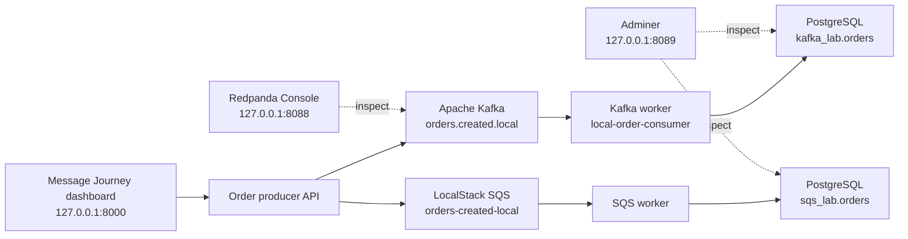

# Visual Local Kafka and SQS Lab

This mode keeps the order application running so you can watch an event move from an API, through Kafka or SQS, into a consumer, and finally into PostgreSQL.

It is separate from automated testing. The local lab keeps stable resources and data for exploration; the test suite continues to use disposable Testcontainers resources.

## What runs



| Component | Purpose | Local address |
|---|---|---|
| Message Journey dashboard | Send events, pause/resume consumers, and see database rows | `http://127.0.0.1:8000` |
| Redpanda Console | Inspect Kafka topics, records, partitions, offsets, headers, and consumer groups | `http://127.0.0.1:8088` |
| Adminer | Inspect PostgreSQL schemas and rows | `http://127.0.0.1:8089` |
| Kafka | Persistent single-node learning broker | `127.0.0.1:29092` |
| LocalStack | Local AWS-compatible SQS endpoint | `http://127.0.0.1:4566` |
| PostgreSQL | Persistent consumer business state | `127.0.0.1:5433` |

All unsecured ports bind only to IPv4 loopback. Other computers on the network cannot access them.

## Prerequisite

Install and start Docker Desktop. Kubernetes is not required; the unrelated `aegis-grid` kind containers can remain stopped.

The first start downloads pinned images and builds the small Python application image. Allow a few minutes. Later starts reuse Docker's cache and persistent volumes.

## Start the lab

From PowerShell in the repository root:

```powershell
powershell -ExecutionPolicy Bypass -File .\scripts\local-lab.ps1 Start
```

The dashboard opens automatically. To start without opening a browser:

```powershell
powershell -ExecutionPolicy Bypass -File .\scripts\local-lab.ps1 Start -NoBrowser
```

## Walkthrough 1: Kafka from API to PostgreSQL

1. Open `http://127.0.0.1:8000`.
2. Confirm Kafka, LocalStack SQS, and PostgreSQL show `up`.
3. In **Publish to a topic**, leave the Kafka consumer running.
4. Press **Send order to Kafka**.
5. Watch all four journey steps complete:
   - API accepted the request.
   - Kafka acknowledged the record.
   - The Kafka consumer picked it up.
   - PostgreSQL stored the row.
6. Copy or visually compare the displayed `event_id` and `correlation_id`.
7. Open Kafka Console and choose **Topics → orders.created.local → Messages**.
8. Expand the record to inspect its key, payload, headers, partition, and offset.
9. Open **Consumer Groups → local-order-consumer** to see the committed position.
10. Open PostgreSQL UI and inspect `kafka_lab.orders`.

Kafka retains the record after it is processed. A committed consumer offset records progress; it does not delete the event.

## Walkthrough 2: Make SQS acknowledgement visible

1. In **Publish to a queue**, press **Pause consumer**.
2. Wait until the card says `Consumer: paused · message will wait`.
3. Press **Send order to SQS**.
4. Observe:
   - API and broker steps are complete.
   - Consumer and PostgreSQL steps are still waiting.
   - LocalStack SQS reports `1 ready`.
   - The PostgreSQL row count has not increased.
5. Press **Resume consumer**.
6. Observe:
   - The consumer and PostgreSQL steps complete.
   - The queue returns to `0 ready`.
   - The exact event appears in the SQS PostgreSQL table.
7. Open PostgreSQL UI and inspect `sqs_lab.orders`.

SQS removes a successfully processed message. Unlike Kafka, there is no retained message to revisit after deletion.

## Adminer login

Use these local-only learning credentials:

| Field | Value |
|---|---|
| System | PostgreSQL |
| Server | `postgres` |
| Username | `mqtest` |
| Password | `mqtest` |
| Database | `mqtest` |

Then choose schema `kafka_lab` or `sqs_lab`, and select the `orders` table.

## Watch consumer logs

```powershell
powershell -ExecutionPolicy Bypass -File .\scripts\local-lab.ps1 Logs
```

Kafka logs show event ID, partition, offset, and duplicate status. SQS logs show the event ID after the message is processed and deleted. Press `Ctrl+C` to stop following logs; the services continue running.

## Stop and restart

Stop containers while preserving topics, messages, offsets, queues, and rows:

```powershell
powershell -ExecutionPolicy Bypass -File .\scripts\local-lab.ps1 Stop
```

Run `Start` again to continue with the same data.

Show current status:

```powershell
powershell -ExecutionPolicy Bypass -File .\scripts\local-lab.ps1 Status
```

## Reset all lab data

This permanently removes the local lab's Docker volumes and stored data:

```powershell
powershell -ExecutionPolicy Bypass -File .\scripts\local-lab.ps1 Reset
```

The script requires typing `RESET`. A later `Start` creates a clean lab again.

## Local mode versus automated tests

| Concern | Visual local mode | Automated test mode |
|---|---|---|
| Goal | Learn and manually inspect | Repeatable verification |
| Ports | Stable | Dynamically assigned |
| Topics/queues | Stable names | Unique per test |
| Data lifetime | Preserved until reset | Removed after tests |
| Consumer | Continuously running | Scoped to the test |
| Main command | `local-lab.ps1 Start` | `python -m pytest` |

Do not point the automated tests at these shared local destinations. Isolation is a deliberate part of the testing architecture.

## Troubleshooting

- **A port is already in use:** stop the application using that port. The chosen ports are `8000`, `8088`, `8089`, `29092`, `4566`, and `5433`.
- **Dashboard says degraded:** run the `Status` action, then the `Logs` action.
- **Kafka Console shows no topic:** wait for `mqtest-local-init` to finish successfully and refresh Console.
- **SQS message count stays at one:** confirm the SQS consumer is resumed and inspect worker logs.
- **Docker Desktop restarts lab containers:** local-lab services use `unless-stopped` so the learning system can survive Docker restarts. Run the `Stop` action when finished.
